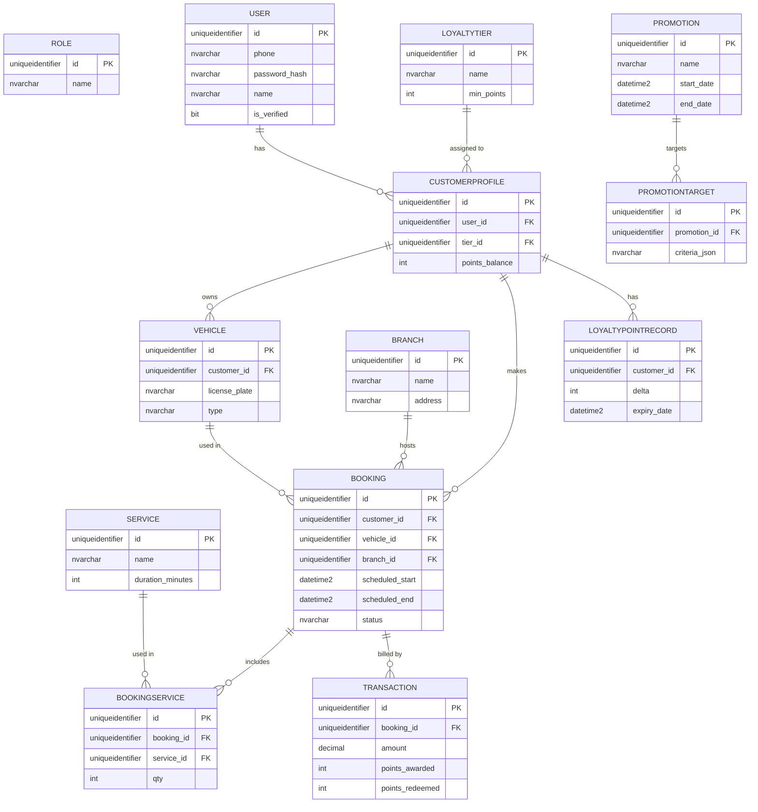

<<<<<<< Updated upstream
ERD Diagram (placeholder)
=======
# AutoWash Pro — erd-diagram.md

## Mermaid ER Diagram

## Relationship explanation
- One User -> One CustomerProfile (one-to-one)
- One CustomerProfile -> Many Vehicles
- Booking references CustomerProfile, Vehicle, Branch
- Many-to-many between Booking and Service via BookingService
- LoyaltyPointRecord tracks each point delta and expiry for audit
>>>>>>> Stashed changes

