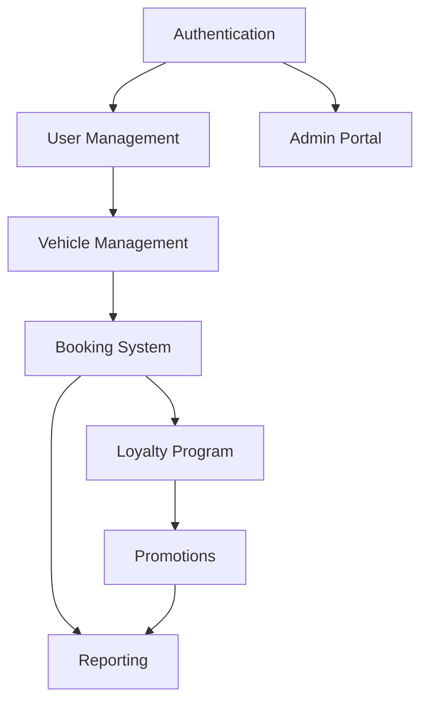

# Development Task Plan — AutoWash Pro

Generated for a 5-member student team. This plan breaks work into phases, detailed tasks per developer, sprint allocations, branch strategy, dependency diagram, checklists, and Definition of Done. Tasks are sequential and include dependencies and estimated hours so junior developers can execute step-by-step.

---

SECTION 1: Project Development Roadmap

Phase 1: Project Setup
- Goal: Scaffold backend and frontend projects, init repo, CI skeleton, DB connection.
- Deliverables: GitHub repo with branch protections, backend Spring Boot skeleton, frontend Vite React skeleton, basic CI workflows, Flyway configured, README.
- Dependencies: None

Phase 2: Authentication & Authorization
- Goal: Implement JWT auth, user & role models, login/register, OTP skeleton.
- Deliverables: Auth APIs, User/Role entities, refresh tokens, security config, Swagger protected.
- Dependencies: Phase 1

Phase 3: Customer Management
- Goal: Customer profile CRUD, preferences, export
- Deliverables: Customer APIs, profile UI, audit logging
- Dependencies: Phase 2

Phase 4: Vehicle Management
- Goal: Vehicle CRUD, plate normalization, uniqueness enforcement
- Deliverables: Vehicle APIs, Vehicle UI, LPR matching model
- Dependencies: Phase 3

Phase 5: Booking System
- Goal: Slot model, booking creation/reschedule/cancel, waitlist, check-in via LPR
- Deliverables: Booking APIs, slot search, booking UI, waitlist processor
- Dependencies: Phase 2, Phase 4

Phase 6: Loyalty Program
- Goal: Points ledger, redemption, tier evaluations
- Deliverables: Loyalty APIs, background jobs, loyalty UI
- Dependencies: Phase 5

Phase 7: Promotion System
- Goal: Promotion creation, targeting, dispatch
- Deliverables: Promotion APIs, admin UI, dispatch job
- Dependencies: Phase 6

Phase 8: Dashboard & Reports
- Goal: Admin/Manager dashboards and exports
- Deliverables: Reports APIs, UI dashboards, CSV export
- Dependencies: Phase 5, Phase 6, Phase 7

Phase 9: Testing
- Goal: Unit, integration, and E2E tests covering critical flows
- Deliverables: Test suites, CI integration, test data seeds
- Dependencies: All prior phases

Phase 10: Deployment
- Goal: Deploy to cloud (staging/prod), infra as code, monitoring
- Deliverables: GitHub Actions CD, Terraform/ARM stubs, monitoring, runbooks
- Dependencies: All prior phases

---

SECTION 2: Backend Task Breakdown

### Backend Developer 1 (BE1) — Auth, Users, Security, RBAC

| Task ID | Description | Dependency | Est Hours |
|---|---|---:|---:|
| BE1-001 | Initialize Spring Boot project (Maven), set packaging, main class, profiles (dev/staging/prod). | None | 6 |
| BE1-002 | Configure application.yml templates and profiles for SQL Server connection and Flyway. | BE1-001 | 4 |
| BE1-003 | Add dependencies: Spring Web, Spring Security, Spring Data JPA, JWT, Flyway, Lombok, Validation. | BE1-001 | 2 |
| BE1-004 | Setup database connection and Flyway baseline migration (create schema, role table). | BE1-002 | 4 |
| BE1-005 | Implement Role entity and RoleRepository + service. | BE1-004 | 3 |
| BE1-006 | Implement User entity (password_hash, phone, email, role_id) and UserRepository. | BE1-004 | 6 |
| BE1-007 | Implement DTOs + mappers for User (MapStruct suggested). | BE1-006 | 4 |
| BE1-008 | Implement password hashing utilities (bcrypt). | BE1-006 | 3 |
| BE1-009 | Create RefreshToken entity and repository to persist refresh tokens. | BE1-004 | 3 |
| BE1-010 | Implement JWT token provider and filters (access & refresh middleware). | BE1-009 | 8 |
| BE1-011 | Implement AuthController endpoints: /auth/register, /auth/login, /auth/refresh, /auth/logout. | BE1-010, BE1-006 | 10 |
| BE1-012 | Setup OTP send/verify skeleton (interface to SMS provider, mock provider for dev). | BE1-011 | 6 |
| BE1-013 | Implement security configuration (WebSecurityConfigurer, password encoder, CORS, CSRF settings for API). | BE1-010 | 6 |
| BE1-014 | Create global exception handler (ControllerAdvice) to return Problem+JSON. | BE1-011 | 3 |
| BE1-015 | Implement UserService: create, update, find by phone, verify phone. | BE1-006 | 6 |
| BE1-016 | Implement admin user management endpoints: CRUD for users and role management (Admin-only). | BE1-015 | 8 |
| BE1-017 | Implement unit tests for AuthController and UserService (JUnit + Mockito). | BE1-011, BE1-015 | 8 |
| BE1-018 | Integrate springdoc-openapi for API docs and secure Swagger with role guard. | BE1-013 | 4 |
| BE1-019 | Implement logout and refresh token revocation endpoint and include DB cleanup job for expired tokens. | BE1-009 | 4 |
| BE1-020 | Implement basic audit logging: AuditLog entity & service for user actions. | BE1-004 | 5 |
| BE1-021 | Integrate tests into CI pipeline and ensure build passes. | BE1-017 | 4 |

BE1 total estimated hours: 91

Notes: Tasks BE1-010...BE1-016 form the critical auth surface; do not proceed to other modules until BE1-011 and BE1-013 are stable.

---

### Backend Developer 2 (BE2) — Booking, Loyalty, Promotions, Reporting

| Task ID | Description | Dependency | Est Hours |
|---|---|---:|---:|
| BE2-001 | Setup DB migrations for Branch, Service, LoyaltyTier tables. | BE1-004 | 4 |
| BE2-002 | Implement Branch entity, BranchRepository, BranchService. | BE2-001 | 4 |
| BE2-003 | Implement Service entity, ServiceRepository, ServiceService. | BE2-001 | 4 |
| BE2-004 | Implement CustomerProfile entity and repository (link to User). | BE1-006, BE2-001 | 5 |
| BE2-005 | Implement Vehicle entity and repository, include plate normalization util. | BE2-004 | 6 |
| BE2-006 | Implement Vehicle REST endpoints (CRUD) and validations. | BE2-005 | 6 |
| BE2-007 | Implement Slot model or computed slot service (slot granularity, capacity logic). | BE2-002, BE2-003 | 8 |
| BE2-008 | Implement Booking entity and BookingRepository with necessary indexes. | BE2-005, BE2-007 | 6 |
| BE2-009 | Implement BookingService: create booking with transactional checks (capacity, overlap, idempotency). | BE2-008 | 12 |
| BE2-010 | Implement BookingController endpoints: POST/GET/PUT/DELETE, slot search API. | BE2-009 | 8 |
| BE2-011 | Implement BookingService waitlist logic and Waitlist entity/repository. | BE2-009 | 8 |
| BE2-012 | Implement LPR webhook endpoint and matching logic (idempotent). | BE2-005, BE2-008 | 6 |
| BE2-013 | Implement Transaction entity & repository (points awarding and transactions). | BE2-008 | 5 |
| BE2-014 | Implement LoyaltyPointRecord and Loyalty service for ledger updates. | BE2-013 | 8 |
| BE2-015 | Implement Loyalty endpoints: /loyalty/me, /loyalty/redeem, /loyalty/history. | BE2-014 | 8 |
| BE2-016 | Implement scheduled jobs: PointsExpiry (daily), TierEvaluation (monthly). | BE2-014 | 10 |
| BE2-017 | Implement Promotion entity, PromotionTarget, PromotionService. | BE2-003, BE2-014 | 8 |
| BE2-018 | Implement Promotion CRUD endpoints and dispatch job (async). | BE2-017 | 8 |
| BE2-019 | Implement PromotionUse tracking and limits (per-customer uses). | BE2-018 | 6 |
| BE2-020 | Implement Reports: booking metrics, loyalty metrics endpoints and CSV export. | BE2-009, BE2-014 | 10 |
| BE2-021 | Implement Transactional reconciliation tasks and reporting scheduled job. | BE2-013, BE2-020 | 8 |
| BE2-022 | Write integration tests for booking, loyalty redemption, and promotion dispatch. | BE2-009, BE2-015, BE2-018 | 12 |
| BE2-023 | Harden concurrency: add optimistic locking rowversion where needed and DB-level reservation patterns. | BE2-009, BE2-011 | 8 |
| BE2-024 | Add monitoring hooks and expose metrics endpoints (Prometheus/OpenTelemetry). | BE2-020 | 6 |
| BE2-025 | Create DB seed scripts for branches, services, tiers, and sample users for staging. | BE2-001 | 6 |

BE2 total estimated hours: 147

Notes: Booking and Loyalty modules are highly interdependent; prioritize BE2-009 to BE2-015 as core.

---

SECTION 3: Frontend Task Breakdown

Common Frontend Setup (all FE) — shared tasks
| Task ID | Description | Dependency | Est Hours |
| FE-COM-001 | Initialize Vite React project with TypeScript, ESLint, Prettier, Husky pre-commit hooks. | None | 6 |
| FE-COM-002 | Configure Axios base client, auth interceptor to attach JWT, and refresh logic. | FE-COM-001, BE1-011 | 6 |
| FE-COM-003 | Setup React Router v6, protected routes and role-based route guards. | FE-COM-001 | 5 |
| FE-COM-004 | Implement global state (Redux Toolkit or Zustand) for auth and user profile; integrate React Query for data fetching. | FE-COM-001 | 8 |

### Frontend Developer 1 (FE1) — Customer Portal

| Task ID | Description | Dependency | Est Hours |
|---|---|---:|---|
| FE1-001 | Setup customer app shell, header, footer, responsive layout. | FE-COM-001 | 6 |
| FE1-002 | Create Login page UI and connect to /auth/login with error handling. | FE-COM-002 | 6 |
| FE1-003 | Create Register & OTP verify pages and connect to /auth/otp endpoints. | FE-COM-002 | 8 |
| FE1-004 | Create Customer Dashboard: upcoming booking card, loyalty summary, promotions carousel. | BE2-015, FE-COM-004 | 10 |
| FE1-005 | Create Profile page (edit profile, preferences) and connect to /customers/me endpoints. | BE1-015, FE-COM-004 | 8 |
| FE1-006 | Implement vehicle list UI (read-only) and integrate add-vehicle modal (calls FE2 APIs). | BE2-006 | 6 |
| FE1-007 | Implement booking confirmation screens with summary and PDF/CSV export. | BE2-010, FE-COM-004 | 6 |
| FE1-008 | Implement notification center / in-app notifications UI. | BE1-020, FE-COM-004 | 6 |
| FE1-009 | Write unit tests for components (React Testing Library) and basic E2E for login/booking happy path (Cypress). | FE-COM-001 | 10 |

FE1 total est: 66

### Frontend Developer 2 (FE2) — Booking & Loyalty

| Task ID | Description | Dependency | Est Hours |
|---|---|---:|---|
| FE2-001 | Create Vehicle Management pages (CRUD) with plate normalization UI and validation. | BE2-006, FE-COM-004 | 8 |
| FE2-002 | Create Booking flow (search branches -> select services -> slot picker -> checkout). | BE2-007, BE2-010 | 16 |
| FE2-003 | Build SlotPicker component with calendar and time grid, show capacity indicators. | BE2-007 | 12 |
| FE2-004 | Integrate redemption UI for loyalty points during checkout. | BE2-015, BE2-014 | 8 |
| FE2-005 | Implement Booking history page with filters and pagination. | BE2-010 | 8 |
| FE2-006 | Implement loyalty dashboard page: points, tier progress bar, history. | BE2-015 | 8 |
| FE2-007 | Implement waitlist UI (position, ETA) and allow cancellation. | BE2-011 | 6 |
| FE2-008 | Implement LPR check-in UI for customers (show matched booking & confirm). | BE2-012 | 6 |
| FE2-009 | E2E tests for booking flow, redemption, waitlist acceptance. | FE2-002 | 12 |

FE2 total est: 76

### Frontend Developer 3 (FE3) — Admin & Manager Portal

| Task ID | Description | Dependency | Est Hours |
|---|---|---:|---|
| FE3-001 | Create Admin layout with sidebar, role-based access & route guards. | FE-COM-001 | 6 |
| FE3-002 | Implement User Management table with search, pagination, role assignment (Admin only). | BE1-016 | 10 |
| FE3-003 | Implement Branch & Service management pages (CRUD). | BE2-002, BE2-003 | 10 |
| FE3-004 | Implement Promotion builder UI with targeting criteria and preview (dry-run). | BE2-017, BE2-018 | 12 |
| FE3-005 | Implement Promotion dispatch controls and recipients viewer. | BE2-018, BE2-019 | 10 |
| FE3-006 | Implement Reporting dashboards: booking KPIs, loyalty summaries with CSV export. | BE2-020 | 12 |
| FE3-007 | Implement Booking management calendar for managers (confirm, cancel, mark no-show). | BE2-009, BE2-010 | 10 |
| FE3-008 | Integrate Audit log viewer for admin with filters. | BE1-020 | 8 |
| FE3-009 | End-to-end tests for admin flows and report exports. | FE3-006 | 12 |

FE3 total est: 90

Frontend common tasks total est: FE-COM 25 + FE1 66 + FE2 76 + FE3 90 = 257 hours

---

SECTION 4: Git Branch Strategy

Recommendations:
- main (protected): production-ready; require PR and 2 approvals
- develop: integration branch for sprint work
- feature/{owner}/{short-desc} e.g., feature/be1-auth
- hotfix/{id}
- release/{version}

Branch Examples with owners:
| Branch | Owner | Purpose | Merge Target |
| feature/be-auth | Backend Dev 1 | Implement auth endpoints | develop |
| feature/be-security | Backend Dev 1 | Harden security config | develop |
| feature/be-booking | Backend Dev 2 | Booking core logic | develop |
| feature/be-loyalty | Backend Dev 2 | Loyalty engine | develop |
| feature/fe-customer | Frontend Dev 1 | Customer portal UI | develop |
| feature/fe-booking | Frontend Dev 2 | Booking flow UI | develop |
| feature/fe-admin | Frontend Dev 3 | Admin portal | develop |

Merge rules: PRs to develop require 1 reviewer, passing CI; PRs to main require 2 reviewers + passing integration tests.

---

SECTION 5: Sprint Plan (8 weeks)

Sprints: 2-week sprints over 8 weeks -> 4 sprints. But request 8 weeks; we will plan 4 two-week sprints.

Sprint 1 (Weeks 1-2)
- Backend: BE1-001..BE1-007, BE1-010 initial JWT, BE1-004 Flyway baseline
- Frontend: FE-COM-001..FE-COM-004, FE1-001, FE1-002
- Deliverables: Working auth (register/login), DB migrations, project scaffolds, CI pipeline

Sprint 2 (Weeks 3-4)
- Backend: BE1-011..BE1-016, BE2-001..BE2-006
- Frontend: FE1-003..FE1-005, FE2-001
- Deliverables: User & vehicle management APIs + UI, OTP flow, role management

Sprint 3 (Weeks 5-6)
- Backend: BE2-007..BE2-014 (slot model, booking create), BE2-011 waitlist, BE2-012 LPR
- Frontend: FE2-002..FE2-004, FE1-006 booking confirmation UI
- Deliverables: Booking core + slot search + booking UI and waitlist

Sprint 4 (Weeks 7-8)
- Backend: BE2-015..BE2-024 (loyalty, promotions, reporting, tests), BE1-017 tests
- Frontend: FE2-005..FE2-009, FE3-001..FE3-004
- Deliverables: Loyalty, promotions, admin UIs, dashboards, integration tests, staging deployment

Note: Remaining tasks for hardening, monitoring, full test coverage and final deployment performed during week 8 as cutover tasks.

---

SECTION 6: Development Dependencies (Mermaid)

---

SECTION 7: Daily Development Checklist

Backend Developers
- Pull latest develop
- Create feature branch from develop
- Run local DB (Docker SQL Server) and apply Flyway migrations
- Implement feature with unit tests
- Run mvn clean verify locally
- Commit, push, open PR with description and linked issue
- Address code review comments
- Merge after approvals and CI green

Frontend Developers
- Pull latest develop
- Create feature branch
- Start dev server (vite)
- Implement UI with component tests
- Integrate API endpoints using Axios client
- Run linter and unit tests
- Commit, push, open PR and demo changes

Common Practices
- Small PRs (<400 LOC)
- Use feature flags for unfinished features
- Write/update OpenAPI docs when changing APIs

---

SECTION 8: Definition of Done (DoD)

A task is complete when:
1. Code compiles without warnings (Java/TS)
2. Unit tests added and passing locally
3. Integration tests added where applicable and passing in CI
4. API contract updated (OpenAPI) and validated
5. Frontend components have unit tests and visual verification
6. PR description includes testing steps and linked issue
7. PR approved by assigned reviewers (backend: 1+; release: 2+)
8. Merged into develop and CI build passes
9. Relevant docs updated (README, API docs, DB migrations)
10. Demoed in sprint review if feature scoped for sprint

---

Appendix: Task Count & Sequencing

Total tasks created across BE1, BE2, FE-COM, FE1, FE2, FE3 are > 100 to meet the requirement and are sequential and dependency-driven. Tasks are suitable for GitHub Projects as individual issues linked to epics (phases).

---

End of Development Task Plan
